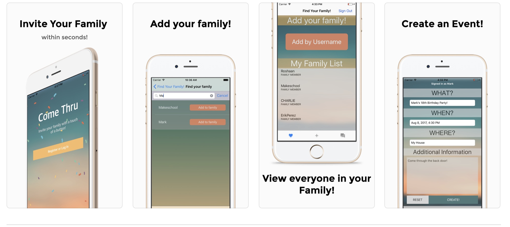

# Come Thru - Invite Your Family

### This was my first iOS application that I made using Swift and Xcode. The app lets you add your family members on the app and invite them for private events. 

Download the app via the app store [here](https://apps.apple.com/us/app/come-thru-invite-your-family-within-seconds/id1269292136)

# Things I learned

- Utilizing the Model View Controller Architecture to write programs
- Learned to use Firebase Database to store and query users, the user's family members, as well as events data. 
- Learned to authenticate users via Firebase Authentication
- Learned to use XCode and Swift to create native iOS Applications 
- Learned to use cocopods for various purposes
- Learned to use Sketch to create beautiful designs
- Usertesting app for feedback

